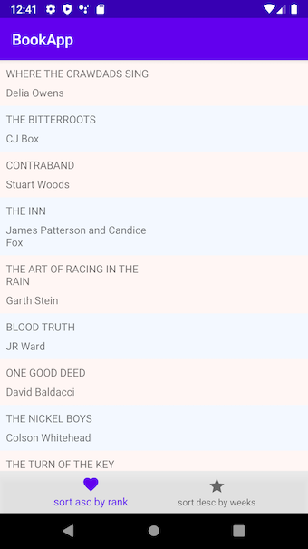
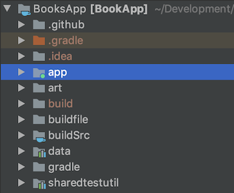
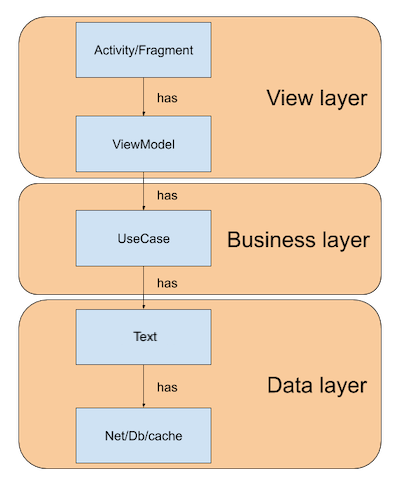
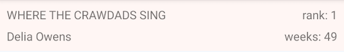
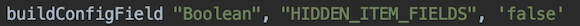

# [Books App](https://play.google.com/store/apps/details?id=com.ciriti.bookapp)

## Code quality
[](https://www.codefactor.io/repository/github/ciriti/booksapp)
[](https://www.codacy.com/manual/ciriti/BooksApp?utm_source=github.com&amp;utm_medium=referral&amp;utm_content=ciriti/BooksApp&amp;utm_campaign=Badge_Grade)

## App status


## Repo info


# Overview



## Development approach
- Each component was created following the **SOLID** principles. My main goal was to write **scalable**, **testable**, **maintainable** code.
  
- I've used the  [**Continuous integration**](https://github.com/ciriti/BooksApp/actions) practice so that I was able to regularly merge the code changes into a repository. After each commit, builds and tests were **automatically** run. 
  
## The project structure
These are the modules of the project:  



* **data**: contains the datasource/service implementations, the network adapter and all the abstractions related with the data domain.
  
* **app**: this is the main module containing the application. It gets the references of all the **data** modules and it takes care of instantiating the implementations of the components and injects them to the view components.
  
* **sharedtestutil**: this is a shaded test utilities module. It provides generic test utilities to all the modules of the app.
  
## The App Architecture
The app components organization is mainly based on the [google architecture](https://developer.android.com/jetpack/docs/guide),

You can think fo the architecture as a **distinct stack of layers**, each layer:
 * doesn't have knowledge af the upper layer,
 * just provides services to the client layer that uses it,
 * addresses a separate concern.
 


## Important libraries used
*  In order to avoid creating object inside the view I decide to use koin over the dependency injection lib Dagger 2 because it is faster to setup and to use. Koin is an implementation of a service locator pattern and it doesn't check at compile time if the dependencies are satisfied.
* 
*  It is is a collection of different patterns use in the scala world.
* **Android Jetpack architecture**
* I haven't use any lib for the data binding, the android extensions are enough in this context.
* : mocking library for Kotlin.
* **[The Gradle plugin de.fayard.buildSrcVersions](https://github.com/jmfayard/refreshVersions)**: 
Painless dependencies management with the gradle kotlin-dsl

## Async operation
For async operation I decide to use coroutines.

## Testing
Each single component is **unit tested**. To test the activity 
I used **espresso**.

To show the rank and the weeks for each item as follows:



you should change in this file `buildfile/gradle_variable.gradle` the following variable to `false`




## Code quality
* **Codacy**: It automates code reviews to improve and standardize code quality across large enterprises. It identifies issues through static code analysis. Integrates with GitLab, GitHub & Bitbucket.
* **CodeFactor.io**: It automatically and continuously tracks code quality with every GitHub or BitBucket commit and pull request, helping software developers save time in code reviews and efficiently tackle technical debt.

## Fastlane

### Upload to Google Play Store

The initial roll-out of a new release start a 10% of the users

```
fastlane supply --apk app/build/outputs/apk/release/*.apk --rollout 0.1
```


